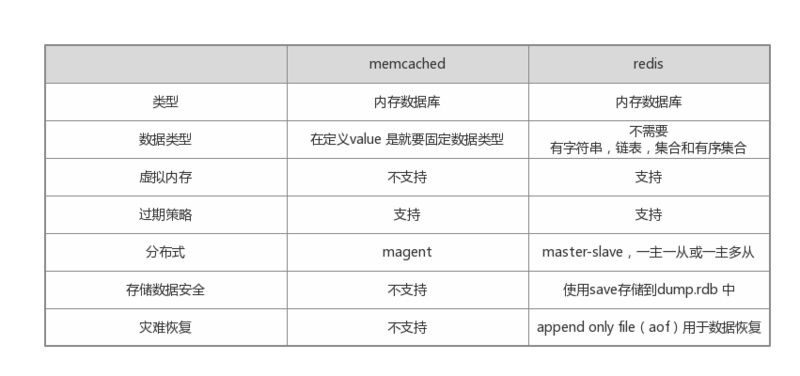

# redis 介绍

一个把数据存储在内存中的高速缓存

可以用来存储字符串，哈希结构，链表，因此常用来提供数据结构服务

# redis 优势

1. Key-Value内存数据库
2. 读写性能强悍 
3. 支持丰富的数据结构:`List`,`Hash`,`Map`, `Set`, `Sorted set (排序的集合)`,`消息订阅与发布(pub/sub)`
4. 可持久化存储 （memchaced不可持久化）,通过一种机制把存储在内存上的数据，也存储在硬盘中.


优点：`高速`，`安全(可持续化)`，`丰富的数据结构`
缺点：消耗内存(内存使用固定)，效率较低（持久化以磁盘存储）


> redis 和 memcached区别

- redis可以用来做存储（`storge`）,memcached用来做缓存（`cache`）
- 存储的数据有“结构”，对于memcacehd来说，存储的数据，只有一种类型:字符串，而reids则可以存字符串，链表，hash结构，集合，有序集合。

都是内存高速缓存数据库，但是redis比memcached支持更多数据类型，且redis可持久化.




# redis 使用范围

> 端口 

redis端口：`6379`


> redis使用范围

1. 计数器. `incr count`
2. SNS社区服务
3. 内存高速缓存
4. 利用redis的集合及数据过期策略，做一个防攻系统
5. 利用消息订阅与发布功能 可以做聊天系统
6. 利用list可以做消息队列服务

`List`把一串数据连在一起。


# 编译安装

```
git clone https://github.com/antirez/redis.git
cd redis
make
```

修改redis配置文件
```
vim redis.conf
daemonize yes // 控制前后台运行
```
启动redis
```
./redis-server reids.conf
./reids-cli
```


> 文件下的可执行文件

```
redis-server: redis服务器的daemon启动程序
redis-cli: redi命令行操作工具
redis-benchmark: redis性能检测工具，测试redis在当前系统及配置下的读写性能
redis-stat: redis 状态检测工具，可以检测reids当前状态参数及延迟状况
```

# 初步使用

```
set key value // 设置
get key // 获取
incr key // 计数
key * // 获取全部
```

> redis持久化的两种方式

- 将数据按照规定的频率保存到硬盘上  原子操作（速度快）
    尽量不要使用保存数据文件方式，会把以前的数据从新保存一遍 （mv）
- 将对数据有修改的操作的命令 保存到文件中， 文件后缀为`.aof`中

```
appendonly on // 开启操作命令保存到文件中的方式
appendsync everysec // 保存的频率
appendfilename appendonly.aof // 保存文件的名字
```

> 基础命令

[redis命令手册](http://doc.redisfans.com/)

**key**
```
keys * // 查看所有key的值
del key // 删除指定的key
exists key  // 判断指定key 是否存在，不存在返回0，存在返回1
pexpire key time // 设置过期时间 (毫秒)
expire key time // 设置过期时间（秒）
ttl // 剩余时间 (秒) key存在，且没有设置过期时间返回-1，key不存在返回-2，其它返回剩余时间
```

**String**
```
strlen key // 字符串长度
get key // 获取字符串
set key value // 设置字符串
mset key value key value // 同时设置多个key值
mget key key // 同时获取多个key值
getbit key offset // 获取key值中的指定位置的的值
incr key // 存储值加一
decr key // 存储值减一
```

# 配置文件 

```
daemonize yes // 控制前后台运行
bind ip // 连接的ip
timeout 0 // 超过多长时间没返回就超时
loglevel notice // 日志级别
databases 16 // 可以指定存储位置，默认是0

save 900 1  // 900秒 有1次数据操作，就同步到硬盘中去
save 300 10 // 300秒 之内有10次操作，就同步到硬盘中去
save 60 10000 // 60秒之内有10000次操作，就同步到硬盘中去

dbfilename dump.rdb // 硬盘存储的数据

slaveof <masterip> <msterport> // 主从服务器

```

# 数据结构


`String`, `List`（链表）,`Set`,`Hash`，`SortedSet`（有序集合）,`Pub/Sub`(发布/订阅)

> List

`List`多个元素链在一起的一串东西.

特点：在任何位置增加或删除元素都很快
缺点：不支持随机存取

是每个元素都是string类型的双向链表
`头指针` --> `data` --> `尾指针`


```
lpush key value1 value2 // 写入链表 
lrenge key start top  // 返回列表 key 中指定区间内的元素，区间以偏移量 start 和 stop 指定 // lrange key 0 -1
lpop key // 移除并返回列表 key 的头元素。
lindex key index // 获取指定index的值
```

> Set


```
sadd key value1 value2 // 写入集合中
smembers key // 获取集合所有元素
sismember key value // 判断value是否存在key中
srem key // 移除指定key

sunion key1 key2 // 集合的并集
sinter key1 key2 // 集合的交集
```

> SortedSet

每一个元素都带有一个权重score，加入到有序集合里的所有元素都根据score进行了排序

```
zadd key score1  value1 score2 value2 // 写入有序集合中
zadd key website 10 sf.gg 9 google.com 
zrange key 0 -1 // 取出所有
```

> Hash


```
hmset key filed1 filed2  // 哈希表 key 中，一个或多个给定域的值。
hmget key filed1 filed2 // 返回哈希表 key 中，一个或多个给定域的值。
```

> 事务

一组操作在同一时间执行，其中有一个失败了，可以回滚到原来操作。

```
multi
    命令1
    命令2
exec
```
放入队列中，管道里暂时不执行
```
multi
incr count
incr count
incr count
exec
```


> Pub/Sub


```
subscribe channel // 订阅
publish channel value // 发布
```


# PHP操作redis


安装`phpredis`，以`.so` 文件扩展形式存在

> 安装

- 进入`phpredis`源码目录，执行`phpize`
- 配置，`./configuer --with-php-config=/phpconfig所在目录`
- make && make install
- 修改php配置文件
    [reids]
    extension="reids.so"
- 重启php


> 使用php操作redis

```
<?php
	$redis = new Redis();
	$connect_result = $reids->connect('127.0.0.1');
	if ($connect_result) {
		$members = array('red', 'tan', 'pink', 'cyan');
		$redis->sadd('setname', 'red', 'tan', 'pink', 'cyan');
		$getmem = $reids->smembers('setname');
		var_dump($getmem);
		$redis->close();
	}
```

> 工具

`nomn`查看系统资源使用率

```
nmon -s 1 -c 20 -f -m ./

-s 间隔多长时间，去抓取系统资源利用率的快照，包括系统资源，网络，硬盘
-c 执行多长时间
-f 结果存文件
-m 文件路径
```

把生成文件，使用树型结构展示，使用`nmon analysre`（windows）工具


`redis-benchmark` reids性能测试

模拟1000个客户端发起1万次测试请求，并统计linux系统资源使用情况。
```
redis-benchmark -c 1000 –n 10000 –csv
```


