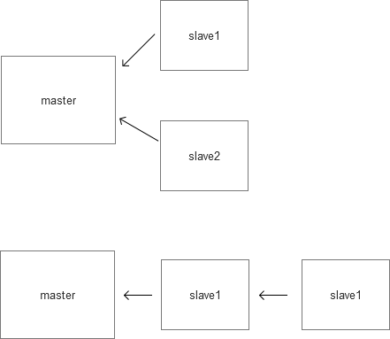
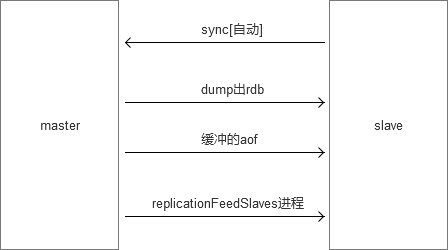

# redis 介绍

一个把数据存储在内存中的高速缓存

可以用来存储字符串，哈希结构，链表，因此常用来提供数据结构服务

# redis 优势

1. Key-Value内存数据库
2. 读写性能强悍 
3. 支持丰富的数据结构:`List`,`Hash`,`Map`, `Set`, `Sorted set (排序的集合)`,`消息订阅与发布(pub/sub)`
4. 可持久化存储 （memchaced不可持久化）,通过一种机制把存储在内存上的数据，也存储在硬盘中.


优点：`高速`，`安全(可持续化)`，`丰富的数据结构`
缺点：消耗内存(内存使用固定)，效率较低（持久化以磁盘存储）


> redis 和 memcached区别

- redis可以用来做存储（`storge`）,memcached用来做缓存（`cache`）
- 存储的数据有“结构”，对于memcacehd来说，存储的数据，只有一种类型:字符串，而reids则可以存字符串，链表，hash结构，集合，有序集合。

都是内存高速缓存数据库，但是redis比memcached支持更多数据类型，且redis可持久化.


|  //   | memcached   |  redis |
| -------- |:-----  | :---- |
|  类型    | 内存数据库     |   内存数据库    |
|  数据类型     | 在定义value是就要固定数据类型 | 不需要，有字符串，链表，集合和有序集合  |
|  虚拟内存  | 不支持    |  支持    |
| 过期策略    | 支持     |  支持    |
|  分布式    | magent     | master-slave, 一主一从，一主多从  |
|  存储数据安全    |  不支持  |  使用 save存储到dump.rdb中   |
|   灾难恢复   | 不支持    |   append only file (aof)用户数据恢复   |

> 文件目录

```
redis-benchmark  reids性能测试工具
redis-check-aof  检查aof日志工具
redis-check-dump 查看rdb日志工具
redis-cli 连接用的客户端
redis-server  redis服务进程
```


# redis 使用范围

> 端口 

redis端口：`6379`


> redis使用范围

1. 计数器. `incr count`
2. SNS社区服务
3. 内存高速缓存
4. 利用redis的集合及数据过期策略，做一个防攻系统
5. 利用消息订阅与发布功能 可以做聊天系统
6. 利用list可以做消息队列服务

`List`把一串数据连在一起。


# 编译安装

```
git clone https://github.com/antirez/redis.git
cd redis
make
```

修改redis配置文件
```
vim redis.conf
daemonize yes // 控制前后台运行
```
启动redis
```
./redis-server reids.conf
./reids-cli
```


> 文件下的可执行文件

```
redis-server: redis服务器的daemon启动程序
redis-cli: redi命令行操作工具
redis-benchmark: redis性能检测工具，测试redis在当前系统及配置下的读写性能
redis-stat: redis 状态检测工具，可以检测reids当前状态参数及延迟状况
```

# 初步使用

```
set key value // 设置
get key // 获取
incr key // 计数
key * // 获取全部
```

> redis持久化的两种方式

- 将数据按照规定的频率保存到硬盘上  原子操作（速度快）
    尽量不要使用保存数据文件方式，会把以前的数据从新保存一遍 （mv）
- 将对数据有修改的操作的命令 保存到文件中， 文件后缀为`.aof`中

```
appendonly on // 开启操作命令保存到文件中的方式
appendsync everysec // 保存的频率
appendfilename appendonly.aof // 保存文件的名字
```

> 通用key操作

[redis命令手册](http://doc.redisfans.com/)


**key**
```
keys pattern // 查询相应的key
```
允许模糊查询key
有3个通配符`*`,`?`,`[]`
`*`任意通配符
`?`单个通配符

```
randomkey // 获取随机的key
type key  // 判断key值的类型
exists key // 判断是否存在key
```
----
```
del key // 删除key
rename oldKey newKey // 修改key名字 （如果原有已经存在key，则覆盖）
renamenx oldKey newKey // 修改已经存在的key值，失败
```
-----
```
keys * // 查看所有key的值
del key // 删除指定的key
exists key  // 判断指定key 是否存在，不存在返回0，存在返回1
ttl key // 剩余时间 (秒) key存在，永久有效返回-1，不存在返回-2，其它返回剩余时间
pexpire key time // 设置过期时间 (毫秒)
expire key time // 设置过期时间（秒）
persist key // 设置永久有效
```

> 基础类型

**String**
```
set key value [ex 生命周期的秒数]/[px 毫秒数] [nx|xx]
set site sf.com ex 10 
```
`ex`和`px`不要同时存在，同时存在报错
`ng`表示key不存在时，执行操作
`xx`表示key存在时，执行操作
```
flusdb // 冲刷db
```
-----
```
mset key value key value // 一次性设置多个键值
mget key1 key2 key3 // 一次性获取多个值
```
-----
```
setrange key offset value // 把字符串的offset偏移字节，改成value
```
如果**偏移量>字符串长度**该字符自动补`\x00`
```
appned key value // 把value追加到key的原值上
getrange key start stop // 获取字符串[start, stop]范围的值 // 对于字符串下标左数从0开始，右数从-1开始
getset key newValue  // 获取旧值设置新值 // 返回旧值
```
-----
```
strlen key // 字符串长度
get key // 获取字符串
set key value // 设置字符串
mset key value key value // 同时设置多个key值
mget key key // 同时获取多个key值
incr key // 存储值加一
decr key // 存储值减一
incrby key number // 存储值加number
decrby key number // 存储值减number
incrbyfloat key number // 存储值加number（number为浮点数）
decrbyfloat key number // 存储值减number(number为浮点数)
```

# 配置文件 


# 配置文件 

```
daemonize yes // 控制前后台运行
bind ip // 连接的ip
timeout 0 // 超过多长时间没返回就超时
loglevel notice // 日志级别

save 900 1  // 900秒 有1次数据操作，就同步到硬盘中去
save 300 10 // 300秒 之内有10次操作，就同步到硬盘中去
save 60 10000 // 60秒之内有10000次操作，就同步到硬盘中去

dbfilename dump.rdb // 硬盘存储的数据

slaveof <masterip> <msterport> // 主从服务器

```

```
databases 16 // 可以指定存储位置，默认使用的是`0`
```
使用`1`号数据库


```
move key 数据库编号 // 移动数据到其它库中
move key 1 
```

# 数据结构


`String`, `List`（链表）,`Set`,`Hash`，`SortedSet`（有序集合）,`Pub/Sub`(发布/订阅)

## List

`List`多个元素链在一起的一串东西.

特点：在任何位置增加或删除元素都很快
缺点：不支持随机存取

是每个元素都是string类型的双向链表
`头指针` --> `data` --> `尾指针`

基本组成：空间，头指针，指向下一个元素的指针。

```
lpush key value1 value2 // 从left写入链表 
rpush  key value1 value2 // 从right写入链表
lrenge key start top  // 返回列表 key 中指定区间内的元素，区间以偏移量 start 和 stop 指定 // lrange key 0 -1
lpop key // 移除并返回列表 key 的头元素。
rpop key // 移除并返回right的最后一个单元值
lindex key index // 获取指定index的值
llen key // 获取List的长度
ltrim key start stop // 从List中截取指定的开始和结束，包括开始和结束字符
lrem key count value // 从List链表中删除 // lrem answer 1 b // 通过值来删除，指定count个数
```


```
linsert key after|before search value // 沿着List找值，然后在值之前或之后插入新值. // linsert num after b hh // 没查询到，返回-1，插入失败。
```
-----
```
lpoprpush source dest // 把srouce的尾部拿出来，放在dest的头部
```
`lpoprpush`是一个原子性操作，如果自己实现通过`lpop`，`rpush`来操作，中间过程中如果有其它操作，就破坏原子性

场景：task + bak 双链表完成安全队列

业务逻辑：
1：rpoplpush task job
2: 接收返回值，并做业务处理
3: 如果成功，rpop job清除任务，彻底删除；如果不成功，下次从bak表里取任务,继续执行


```
brpop key timeout // 等待弹出key的尾元素
blpop key timeout // 等待弹出key的头元素
```
`timeout` 为等待超时时间，如果`timeout`为0，则一直等待。

场景: 长轮询Ajax，在线聊天

> 位图法统计活跃用户

1：记录用户登陆：
每天按日期生成一个位图，用户登陆后，把user_id位上的bit位置1

2： 把1周的位图 and 计算，
位上位1的，即使连续登陆的用户

```
setbit mon 100000000 0
setbit mon 3 1
setbit mon 5 1
setbit mon 7 1
setbit thur 100000000 0
setbit thur 3 1
setbit thur 5 1
setbit thur 8 1
setbit wen 100000000 0
setbit wen 3 1
setbit wen 4 1
setbit wen 6 1
bitop and res mon thur wen
```

优点：
1. 节约空间，1亿人每天的登陆情况，用1亿bit，约10M的字符就能表示
2. 计算快，计算方便

## Set 

特点：

- 无序性
- 确定性 （描述是确定的）
- 唯一性 （Set的值是唯一，不重复，独一无二）


```
sadd key value1 value2 // 写入集合中
smembers key // 获取集合所有元素
sismember key value // 判断value是否存在key中
srem key // 移除指定key
spop key // 返回并删除集合key的1个随机元素
srendmember key // 返回随机的元素
scard key // 返回集合中的长度
```
-----
```
smove srouce dest value // 把srouce中的value删除，并添加到dest集合中
sunion key1 key2 key3... // 集合的并集
sinter key1 key2... // 集合的交集
sdiff key1 key2 // 集合的差集

sinterstoure result key1 key2 kye3  // 把集合中的结果保存起来
```


## SortedSet

`Order Set` 有序集合
集合本来是无序，既然是有序集合，必然是需要一个排序的`因子`(排序的一句，使用什么来排序)，每个元素都需要一个`score`

每一个元素都带有一个权重score，加入到有序集合里的所有元素都根据score进行了排序

```
zadd key score1 value1 score2 value2 // 写入有序集合中
zadd key website 10 sf.gg 9 google.com 
zrange key 0 -1 [withscores] // 取出所有 // 默认升序 // 指定widthsrouces，一并取出指定的srouce
zrangebyscoure key min max [withscores] limit offset N // 取srouce的[min, max]之内的元素，并跳过offset，取出N个 // 指定widthsrouces，一并取出指定的srouce
```
-----
```
zrank key member // 查询member在集合中的位置
zrevrank key member // 倒序查看member在集合中的位置

zrem  key value1 value2 // 根据value来删除指定元素
zremrangebyscore key min max  // 根据score来删除指定[min, max]范围的元素
zcard key // 返回元素个数
zcount key min max // 返回[min, max]区间内的元素数量
zinterstore destination numbers key1 key2 [WEIGHTS weight] aggregate [sum|min|max] // key1，key2的交集，权重是weight。聚合方法是sum|min|max， 聚合的结果放入des中
```


## Hash

`Hash`类似PHP的`关联数组`.
很多单元不是通过索引，而是通过键来标记.
Hash是一个复合结构，每一个值都是有一个独特的键，指向Hash结构

```
hset key field value // Hash设置
hget key field // 获取Hash给定的key值
hmset key filed1 value  field2 value  // 哈希表 key 中，一个或多个给定域的值。
hmget key field1 field2 // 返回哈希表 key 中，一个或多个给定域的值。
hgetall key // 返回给定key的所有field
hdel key field // 删除key中field域
hlen key // 返回中的元素数量
hexists key field // 判断key中有没有field域 
hkeys key // 返回key的所有键
hvals key // 返回key的所有值
```


## 事务

一组操作在同一时间执行，其中有一个失败了，可以回滚到原来操作。
redis与mysql事务的对比：

|  //   | mysql    |  redis |
| -------- |:-----  | :---- |
|  开启     | start transaction     |   mutil    |
|  语句     | 普通sql     |   普通命令    |
|  失败     | rollback 回滚    |   discard取消   |
|  成功     |  commit   |   exec   |

注：rollback与discard的区别
如果已经成功执行了2条语句，第3条语句错误
rollback后，前2条的语句影响消失
discard姿势结束本次事务，前2条语句造成的影响仍然还在

注：在mutil后的语句中，语句出错可能有2中情况
1： 语法就有问题。
这种exec时，报错，所有语句得不到执行
2： 语法本身没错，但使用对象有问题。比如 zadd操作Link对象exec之后，会执行正确的语句，并跳过不适当的语句。


```
multi
    命令1
    命令2
exec
```
放入队列中，管道里暂时不执行
```
multi
incr count
incr count
incr count
exec
```


## Pub/Sub


```
subscribe channel // 订阅
publish channel value // 发布
```

# rdb快照

rdb快照持久化

持久化：即把数据存储与断点不会丢失的设备中，通常是硬盘。

常见的持久化方式：

- 主从：通过主从服务器保持和持久化，如mongoDB的replication sets配置
- 日志：操作生成相关日志，并通过日志来恢复数据，
- couchDB对于数据内容，不修改，只追加，则文件本身即是日志，不会丢失数据。


reids持久化的方式：

- rdb
- aof


rdb的工作原理：

rdb 快照是照`内存`.
每隔`N分钟或N次`写操作后，从内存dump数据形成rdb文件，`压缩`，放在备份`目录`

`redis-server`的主进程和`rdb导出的子进程`，一旦达到触发条件，就调用rdbdump进程。

因为导出的是二进制印象，恢复速度非常快。


rdb快照相关参数:
```
save 900 1 // 刷新快照到硬盘中，必须满足两者要求才触发，即900秒之后至少1一个关键字发生变化。
save 300 10 // 必须是300秒之后只至少10个关键字发生变化
save 60 10000 // 必须是60秒之后至少10000个关键字发生变化 
// 屏蔽save三个选项，则rdb禁用。找不到导出规则，则永远都不导出

stop-writes-on-bgsave-error yes // 后台导出存储错误了，则停止写入(如果后台保存出错，还一直写入，造成数据不一致)
rdbcompression yes // 使用LZF压缩rdb文件
rdbchecksum yes // 存储和加载rdb文件时校验
dbfilename dump.rdb // 设置rdb文件名
dir ./ // 设置工作目录，rdb文件会写入该目录
```

`reids.conf`中的配置项


从后往前看，时间越来越长，条件越来越松。


rdb的缺陷：

在2个保存点之前，断电，将会丢失1-N分钟的数据。
处于对持久化的更精细要求，redis增添了`aof(append only file)`方式

现在reids处理持久化数据，一般是`rdb`和`aof`配合使用。


# aof

aof日志持久化

工作原理：
`reids-server`进程接受命令，把执行的命令通过`aof`子进程写到文本文件.


```
appendonly on // 是否打开 aof日志功能

appencfsync always // 每一个命令，都立即同步到aof，安全，速度慢
appendfsync everysec // 每秒写一次，折中方案
appendfsync no 写入工作交给操作系统，由操作系统判断缓冲区大小，统一写入到aof。同步频率低，速度快

no-appendfsync-on-rewrite yes // 正在到处rdb快照的过程中，要不要停止同步aof
auto-aof-rewrite-precentage 100 // aof文件大小比起上次重写时的大小，增长率100%时，重写
auto-aof-rewrite-min-size 64mb // aof文件，至少超过64M时，重写。
```

注：在dump.rdb过程中，aof如果停止同步，会不会丢失？
不会，所有的操作缓存在内存的队列里，dump完成后，统一操作


> aof重写时指什么?

aof重写是指把内存中的数据，逆化成命令，写入到aof日志里，以解决aof日志过大的问题。


场景：同一个key，操作100次。

把内存中的key/value逆化成相关的命令
所有的key在内存中有一个具体的状态

如：
```
set age 0
incr age
incr age
...
incr age

get age // 100

// 逆化成 (最终结果，最终状态)
set age 100
```

`aof`重写的条件

```
auto-aof-rewrite-percentage 100 aof文件大小比起上次重写时的大小，增长率100%时，重写 // 如果只有这个条件，前期aof文件为0重写很频繁，加后面一个条件制约（需要达到64mb）
auto-aof-rewrite-min-size 64mb 
```
命令重写：
```
bgrewriteaof
```


> 如果rdb文件和aof文件都存在，优先用谁来恢复数据？

aof


> 2种可以同时使用么？

可以，reids推荐这种用法


> 恢复时，rdb和aof哪个恢复快
rdb快，因为其是数据的内存映射，直接载入到内存，而aof是命令，需要逐条执行。


# 主从复制

reids集群。

集群的作用：

- 主从备份 防止主机宕机
- 读写分离，分担maste的任务
- 任务分离，如从服务器分别备份工作与计算工作
- master宕机后，可以直接切换到slave1

集群方式：
- 星型
- 直线型



> 主从通信过程

master和slave之前如何达到同步




> 主从配置

master配置：
1: 关闭rdb快照（备份工作交给slave）
2: 可以开启aof
```
slaveof localhost 6379
```

slave配置：
1: 声明slave-of
2: 配置密码[如果master有密码]
3: [某1个]slave打开rdb快照功能
4: 配置是否只读[slave-read-only]


```
./src/redis-cli -p 6381
```

缺陷：

每次salave断开后（无论是主动断开，还是网络故障）
再连接master，都要master全部dump出来rdb，再aof(同步的过程都要重新执行一遍)


注：多台slave，不要一下启动起来，否则master可能IO剧增

# redis运维简单命令

```
time // 查看时间戳与微妙数
dbsize // 查看当前库中的key数量
bgrewriteaof // 后台进程重写aof
bgsave // 后台保存rdb快照 // 后台进程在做dump
save // 保存rdb快照
lastsave // 上次保存时间
slaveof // 设置slave服务器
```
-----
```
flushall // 清空所有db
flushdb // 清空当前db
shutdown [""|save|nosave] // 断开连接，关闭服务器
```
如果不小心运行flushall,立即 shutdown nosave，关闭服务器然后手工编辑aof文件，去掉文件中的`flushall`相关行，然后开启服务器，就可以导入原来数据。
如果，flushall之后，系统恰好bgrewriteaof了，那么aof就清空了，数据丢失。

```
info // 服务器的信息
info Stats
info CPU

```
-----

```
1：内存
# Memory
user_memory: 1946832 // 数据结构的空间
user_memory_rss: 602516 // 实占空间
mem_fragmentatation_ratio: 3.09 // 前2者的比例，1N为佳，如果此值过大，说明redis的内存的碎片化严重，可以到处再导入一次
2: 主从复制
# Replication
role: slave
master_host: 192.168.1.10
master_prot: 6379
master_link_status: up
3:持久化
# Persistence
rdb_changes_since_last_save: 0
rbd_last_save_time: 1342356063
4:fork耗时
# Status
latest_for_usec: 963 // 上次导出rdb快照，持久化花费微秒 //  注：如果某实例有10G内容，导出需要2分钟，每分钟写入10000次，导致不断的rdb导出，磁盘始处于高IO状态。
```
-----
```
config get requirepass // 获取配置
config set requirepass value  // 设置配置 // 特殊的选项，不允许用此命令设置，如slave-of,需要用单独的slaveof命令来设置
slowlog // 显示慢查询 (执行命令比较慢，记录起来)
config get showlog-log-slower-than
```

> 多久才叫慢

由`sholog-log-slower-than 10000` 来指定（单位微秒）

> 服务器存储多少条慢查询的记录

由`slowlog-max-len 128`来做限制

# aof恢复与rdb服务器间迁移

> aof恢复

场景：不小心`flushall`怎么办？

有`aof`，但是存在一种`aof`重写情况。
当不小心运行`flushall`，要立即运行`shutdown nosave`，保证防止发生`aof`重写的情况。要指定`nosave`选项，不让保存到重写aof中。
关闭redis之后，把`aof`的文件修改，`flushall`命令删除。然后重启redis。


> rdb服务器迁移

拷贝需要迁移的rdb文件，文件名为当前redis配置的`redis.conf`中的`dbfilename`选项配置相同。

注意：
在redis进程处于运行时，rdb处于打开状态。复制文件时，占据同样的句柄，导致rdb文件复制是相同。

# PHP操作redis


安装`phpredis`，以`.so` 文件扩展形式存在

> 安装

- 进入`phpredis`源码目录，执行`phpize`
- 配置，`./configuer --with-php-config=/phpconfig所在目录`
- make && make install
- 修改php配置文件
    [reids]
    extension="reids.so"
- 重启php


> 使用php操作redis

```
<?php
	$redis = new Redis();
	$connect_result = $reids->connect('127.0.0.1');
	if ($connect_result) {
		$members = array('red', 'tan', 'pink', 'cyan');
		$redis->sadd('setname', 'red', 'tan', 'pink', 'cyan');
		$getmem = $reids->smembers('setname');
		var_dump($getmem);
		$redis->close();
	}
```

> 工具

`nomn`查看系统资源使用率

```
nmon -s 1 -c 20 -f -m ./

-s 间隔多长时间，去抓取系统资源利用率的快照，包括系统资源，网络，硬盘
-c 执行多长时间
-f 结果存文件
-m 文件路径
```

把生成文件，使用树型结构展示，使用`nmon analysre`（windows）工具


`redis-benchmark` reids性能测试

模拟1000个客户端发起1万次测试请求，并统计linux系统资源使用情况。
```
redis-benchmark -c 1000 –n 10000 –csv
```


